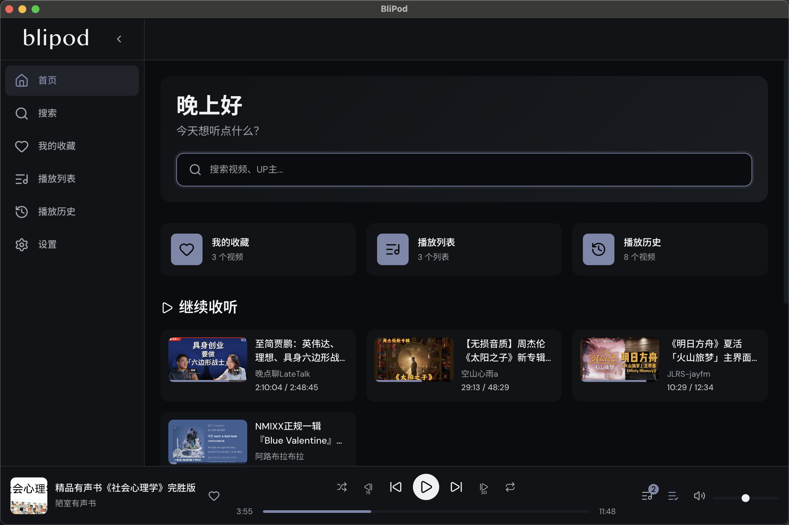
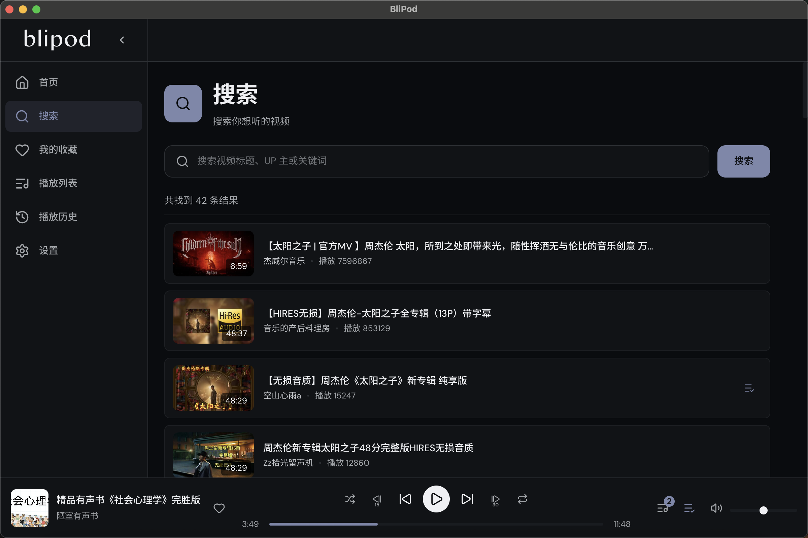
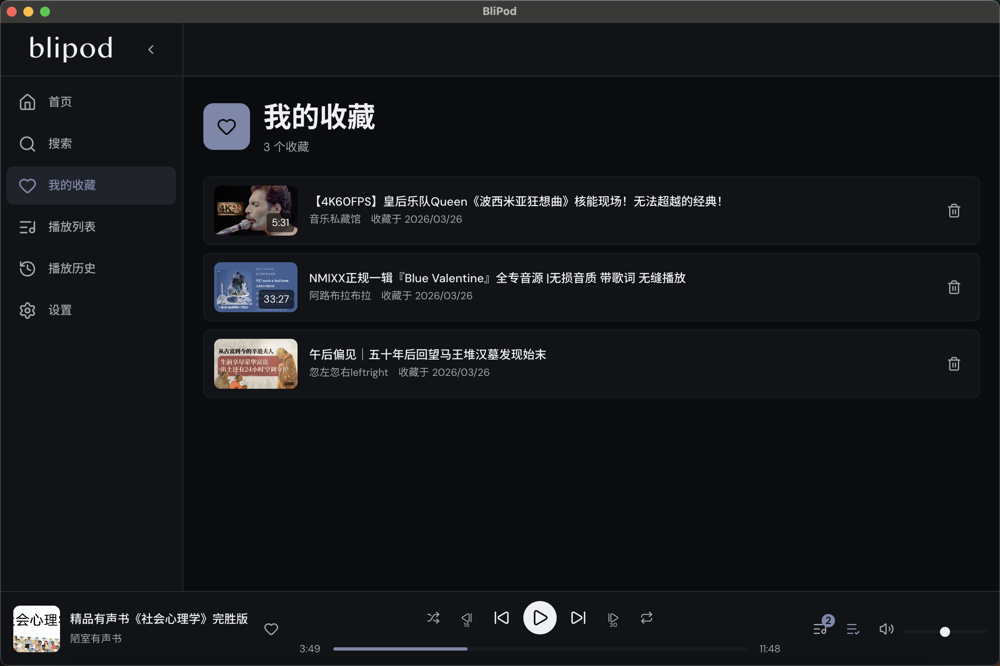
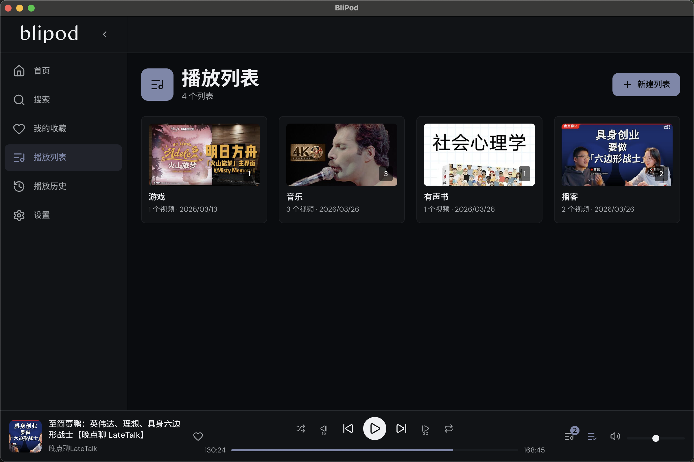
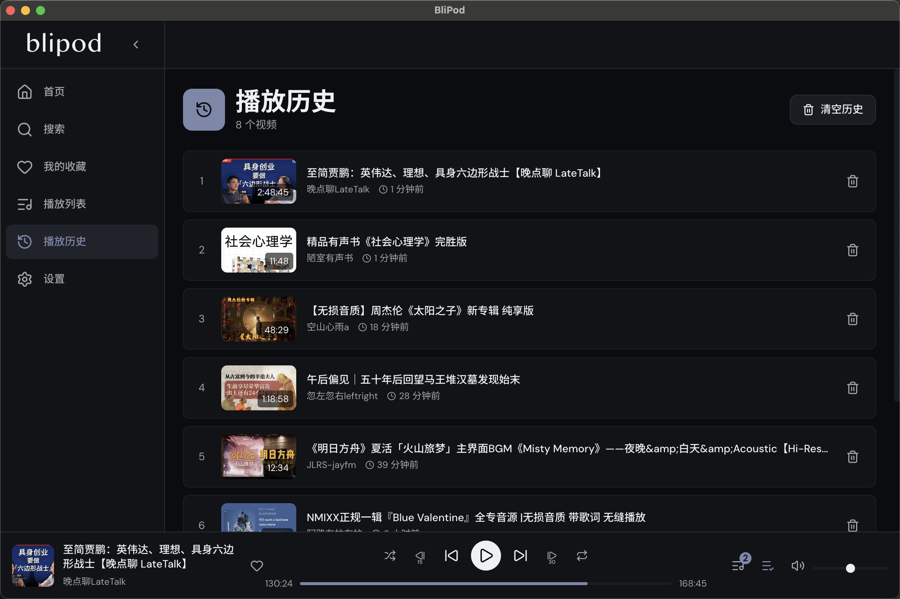
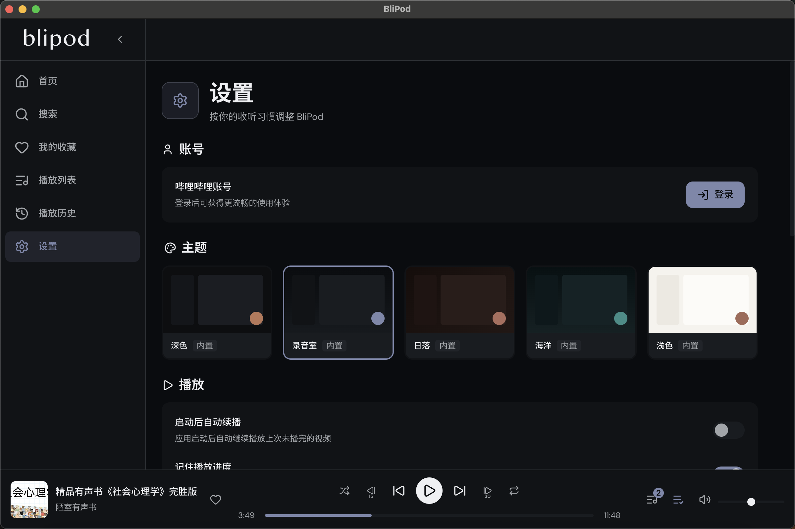

<div align="center">
  

  # BliPod

  > 把 Bilibili 视频变成更适合后台收听的桌面 Podcast 体验。

  <p>
    
    
    
    
    
  </p>
</div>

BliPod 是一个面向长时间收听场景的 Bilibili 桌面播放器，适合把视频内容当作播客、音乐、访谈、直播回放或知识节目来听。

它把“搜索、播放、收藏、队列、播放列表、历史、续播”整合在一个安静、专注的桌面界面里，让你能像管理 Podcast 一样管理 B 站内容。

**适合这些场景：**
- 工作、写代码时后台收听 B 站内容
- 把零散视频整理成自己的长期收听库
- 通过收藏、队列和播放列表建立更稳定的收听流程

## 项目截图

### 首页



### 搜索



### 我的收藏



### 播放列表



### 播放历史



### 设置



## 功能特性

- 以桌面应用方式收听 Bilibili 视频内容
- 搜索视频、分页加载结果，并支持搜索历史
- 支持进入 UP 主页查看投稿内容
- 内置播放器，支持播放 / 暂停、上一首 / 下一首、快进快退、拖动进度、静音、音量、随机播放、单曲循环
- 支持多P视频：播放条提供独立分P面板，可查看并切换当前视频各分P
- 支持“继续收听”，自动衔接上次未播完内容，并在多P视频中恢复到最近一次实际播放的分P与进度
- 收藏视频，并在首页展示最近收藏
- 自定义播放队列，可随时加入、移除、清空
- 创建播放列表，支持编辑、删除、播放全部、随机播放
- 保存播放历史，并支持单条移除或清空；多P视频会记录最近一次实际播放的 `P` 信息
- 记住播放进度；同一多P视频的不同分P会分别保存续播位置，切换回对应 P 时可恢复该分P自己的进度
- 支持多P视频自然播完当前分P后按设置自动进入下一P
- 支持哔哩哔哩扫码登录
- 内置多套主题，后续会支持自定义主题能力
- 支持数据导入 / 导出，便于迁移本地数据

## 主要页面

- **首页**：展示快捷入口、继续收听、最近收藏
- **搜索**：搜索视频或 UP 主，支持收藏、加入播放队列、加入播放列表
- **UP 主页**：查看指定 UP 主的视频列表
- **我的收藏**：集中管理已收藏的视频
- **播放列表**：创建和维护自己的收听列表
- **播放历史**：查看最近播放记录
- **设置**：账号、主题、播放、内存管理、数据导入导出、关于信息

## 技术栈

- Electron
- Vue 3
- Pinia
- Vue Router
- Vite
- TypeScript
- UnoCSS

## 本地开发

### 环境要求

- Node.js
- npm

> 项目当前使用 `package-lock.json`，默认采用 `npm`。

### 安装依赖

```bash
npm install
```

### 启动开发环境

```bash
npm run dev
```

### 启动 Electron

```bash
npm run start
```

### 类型检查

```bash
npm run typecheck
```

### 构建

```bash
npm run build
```

## 打包

### 生成应用目录

```bash
npm run app:dir
```

### 生成发行包

```bash
npm run app:dist
```

## 数据管理

设置页内置数据导入导出功能，当前支持以下分类：

- 收藏列表
- 播放列表
- 播放队列
- 应用设置

导入时支持两种策略：

- **合并导入**：保留现有数据
- **覆盖导入**：替换现有数据

## 使用说明

1. 打开应用后，可从首页直接进入搜索
2. 在搜索页输入关键词，查找想听的视频
3. 搜索结果支持直接播放、收藏、加入播放队列、加入播放列表
4. 如果需要更流畅的访问体验，可在设置页使用哔哩哔哩扫码登录
5. 通过收藏、播放列表、历史和继续收听，逐步建立自己的收听库

## 注意事项

- 本项目是桌面端收听工具，内容来源依赖 Bilibili 页面与接口
- 部分搜索、UP 主页数据获取会受到登录状态、网络环境或平台风控影响

## License

MIT License
